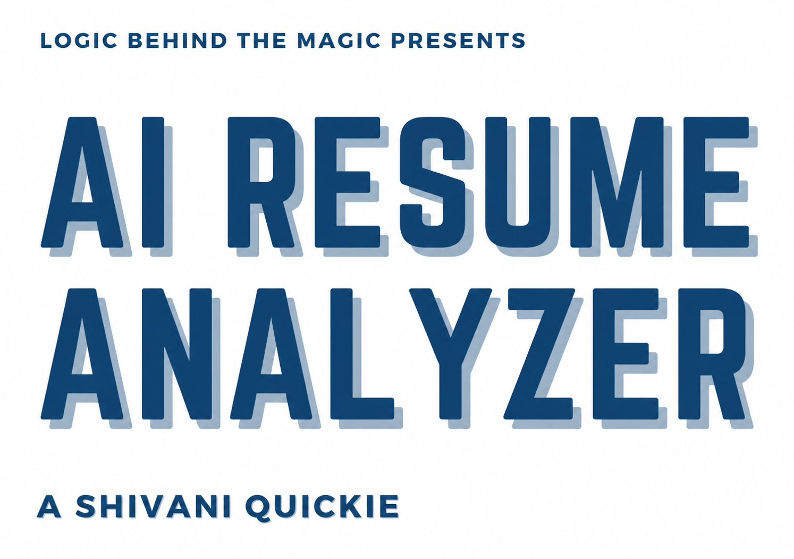
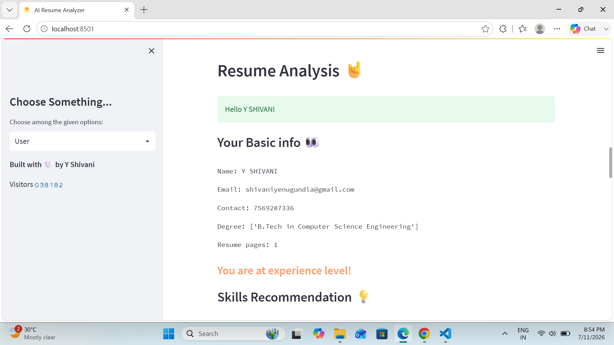
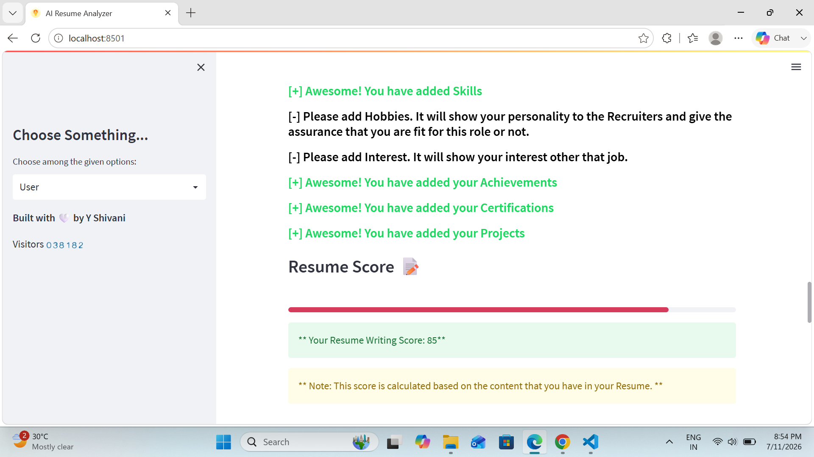
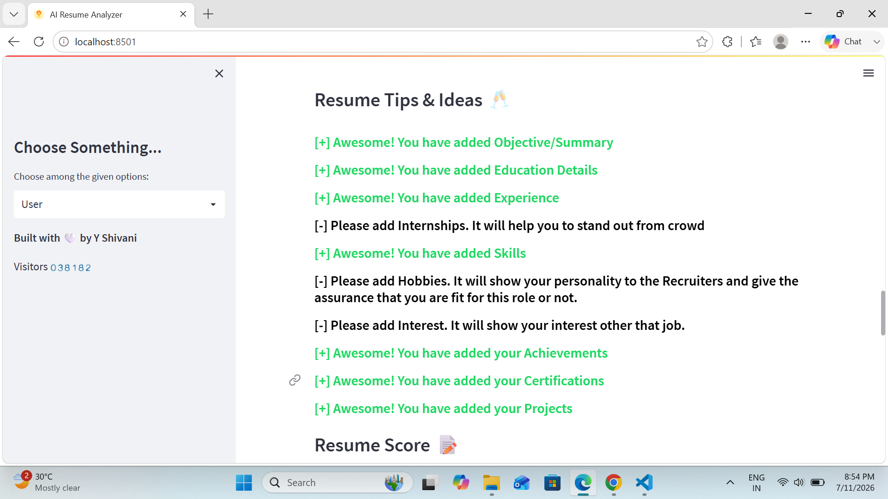

# 📄 Resume Analyzer

An AI-powered Resume Analyzer that extracts information from resumes, analyzes technical skills, predicts suitable job roles, generates resume scores, and provides personalized recommendations to help job seekers improve their resumes.

---

## 🚀 Features

- 📂 Upload Resume (PDF)
- 📝 Resume Information Extraction
- 🎯 Resume Skill Analysis
- 💼 Job Role Prediction
- 📊 Resume Score Generation
- 📚 Course Recommendations
- 💡 Resume Improvement Tips
- 🎥 Interview Preparation Videos
- 📈 Admin Dashboard
- 📥 Export Applicant Data to CSV

---

## 🛠️ Tech Stack

### Frontend
- Streamlit
- HTML
- CSS

### Backend
- Python

### Database
- MySQL

### Libraries Used
- pyresparser
- pandas
- pdfminer3
- nltk
- plotly
- spaCy
- streamlit

---

## 📂 Project Structure

```text
Resume-Analyzer/
│
├── App/
│   ├── App.py
│   ├── Courses.py
│   ├── requirements.txt
│   └── ...
│
├── pyresparser/
│
├── screenshots/
│   ├── Dashboard.png
│   ├── RESUME.png
│   ├── Resume_Analysis.png
│   ├── ResumeScore.png
│   └── ResumeTips.png
│
├── LICENSE
├── README.md
└── requirements.txt
```

---

## ⚙️ Installation

### Clone Repository

```bash
git clone https://github.com/shivani-cse/Resume-Analyzer.git
```

### Move into Project Folder

```bash
cd Resume-Analyzer
```

### Create Virtual Environment

```bash
python -m venv venv
```

### Activate Virtual Environment

Windows

```bash
venv\Scripts\activate
```

Linux / macOS

```bash
source venv/bin/activate
```

### Install Required Libraries

```bash
cd App
pip install -r requirements.txt
```

### Download SpaCy Model

```bash
python -m spacy download en_core_web_sm
```

### Run the Project

```bash
streamlit run App.py
```

---

## 📸 Project Screenshots

### 🏠 Home Page



---

### 📄 Resume Analysis



---

### 📊 Resume Score



---

### 💡 Resume Tips



---

## 🔄 Workflow

1. Upload a Resume (PDF)
2. Extract Resume Information
3. Analyze Skills
4. Predict Job Role
5. Generate Resume Score
6. Recommend Skills & Courses
7. Display Resume Tips
8. Export Data (Admin)

---

## 🎯 Future Enhancements

- ATS Compatibility Score
- AI Resume Rewriting
- GPT-Based Resume Suggestions
- LinkedIn Profile Analysis
- Multi-language Resume Support
- Cloud Deployment
- Resume Keyword Optimization

---


## 👩‍💻 Author

**Shivani**

- GitHub: https://github.com/shivani-cse
- LinkedIn:https://linkedin.com/in/yshivani2

---

## 📜 License

This project is licensed under the MIT License.


---